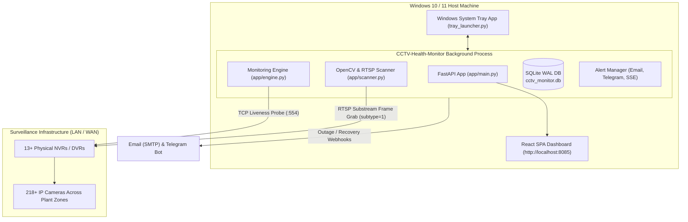
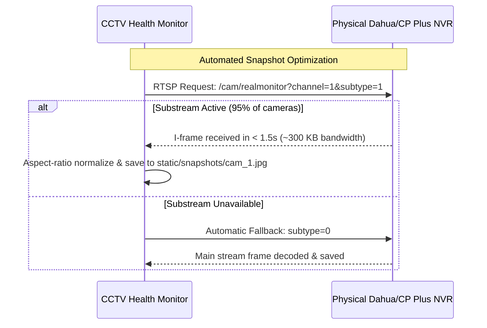

# 📹 CCTV Health Monitoring System

[-blue.svg)](https://github.com/lalitmahajn/CCTV-Health-Monitor)
[](https://www.python.org/)
[](https://fastapi.tiangolo.com/)
[](https://react.dev/)
[](https://opencv.org/)
[-003B57.svg)](https://www.sqlite.org/)
[]()

An enterprise-grade, real-time CCTV & NVR/DVR health surveillance solution designed to monitor large fleets of IP cameras across industrial plants and enterprise facilities. Features **24/7 background telemetry**, **instant outage alerts**, **substream-accelerated thumbnail grabs**, **interactive multi-group inventory**, and a **native Windows System Tray application** with a turnkey Windows Setup Installer.

---

## 📑 Table of Contents

- [Key Highlights](#-key-highlights)
- [System Architecture](#-system-architecture)
- [Core Features](#-core-features)
- [Installation & Deployment](#-installation--deployment)
  - [Option A: Windows Setup Wizard (.exe Installer)](#option-a-windows-setup-wizard-exe-installer-recommended)
  - [Option B: Running from Source (Developer Mode)](#option-b-running-from-source-developer-mode)
- [System Tray & 24/7 Background Operation](#-system-tray--247-background-operation)
- [Port Configuration & Anti-Conflict System](#-port-configuration--anti-conflict-system)
- [Fleet Snapshot Engine & Subtypes](#-fleet-snapshot-engine--subtypes)
- [API Reference](#-api-reference)
- [Building the Installer from Source](#-building-the-installer-from-source)
- [Troubleshooting & FAQs](#-troubleshooting--faqs)

---

## 🌟 Key Highlights

- **Zero-Install Client Deployment**: Distributed via a self-contained 100 MB Windows installer (`Setup.exe`). Requires **no Python, Node.js, or external runtimes** on client PCs.
- **24/7 Background Telemetry**: Closing the web browser tab never stops the monitor. The engine operates silently in the Windows System Tray.
- **Substream-Accelerated (`subtype=1`) Snapshots**: Captures live thumbnail keyframes in **under 2.5 seconds** with **90% less bandwidth** than high-bitrate recording streams.
- **Smart Concurrency Throttling**: Bounded per-bay worker pool prevents overwhelming physical DVR/NVR hardware while maintaining high fleet refresh throughput.
- **Dynamic Port Conflict Resolution**: Defaults to port `8085` and automatically scans for the next open port if occupied. Configurable via plain-text `config.ini`.
- **Fault-Tolerant SQLite WAL**: Concurrency-protected write-ahead logging with 30-second busy timeout eliminates database lock errors.

---

## 🏗 System Architecture



---

## 🚀 Core Features

### 1. Executive Fleet Health Dashboard
- Real-time gauge metrics: Online, Degraded, Offline, and Spare/No-Cam channels.
- Fleet uptime trend line chart (24h history).
- Live latency and connection jitter statistics.
- Server-Sent Events (SSE) for sub-second, zero-reload dashboard telemetry.

### 2. Expandable Multi-Group Inventory
- **Group by DVR / NVR Bay**: Inspect channels sorted by physical hardware box (`01`, `02`, `03`...).
- **Group by Location / Zone**: Filter by plant areas (e.g., *Production Area*, *Security Cabin*, *Stores*, *Boiler*).
- **Group by Health Status**: View *Offline* cameras first, followed by *Spares* and *Online*.
- **Flat List Mode**: Classic searchable, paginated table view.
- **Spare Channel Management**: Toggle unequipped channels to `Spare / No Cam` to exclude them from outage alerts.
- **Excel & CSV Export / Import**: Bulk-edit camera configurations via spreadsheets.

### 3. Rapid Keyframe Snapshot Engine
- Auto-swaps Dahua/CP Plus URLs to `subtype=1` for rapid 2-second keyframe grabs.
- Fallback to `subtype=0` for older analog DVRs or encoders without substreams.
- Batch "Update All Snapshots" with live progress counter (`X / 218 processed`, `Y succeeded`, `Z failed`).
- Aspect ratio correction ensuring 4:3 and 16:9 previews render distortion-free.

### 4. Enterprise Incident & Audit Management
- Automatic incident opening with failure reason tracking upon consecutive ping drops.
- Auto-recovery duration logging when feeds come back online.
- Comprehensive audit trail recording authentication, configuration changes, spare toggles, and manual scans.

---

## 📦 Installation & Deployment

### Option A: Windows Setup Wizard (.exe Installer) *(Recommended)*

For production or client machines, use the turnkey standalone installer:

1. Download or copy **`installer_output\CCTV_Health_Monitor_Setup_v1.0.0.exe`**.
2. Double-click the installer and follow the wizard prompts:
   - Select installation directory (Default: `C:\Program Files\CCTV Health Monitor`).
   - Choose whether to create a Desktop shortcut.
   - Choose whether to enable **"Automatically start CCTV Health Monitor when Windows boots"**.
3. Click **Install**.
4. Check **"Launch CCTV Health Monitor"** and click **Finish**.
5. The application will start silently, place a camera icon in the Windows System Tray, and open your web browser to `http://localhost:8085`.

---

### Option B: Running from Source (Developer Mode)

#### Prerequisites
- Python 3.11+ (64-bit)
- Node.js 18+ and npm (for frontend development)

#### 1. Clone the Repository
```bash
git clone https://github.com/lalitmahajn/CCTV-Health-Monitor.git
cd CCTV-Health-Monitor
```

#### 2. Install Backend Dependencies
```powershell
python -m pip install -r requirements.txt
python -m pip install pystray Pillow
```

#### 3. Build the Frontend SPA
```powershell
cd frontend
npm install
npm run build
cd ..
```

#### 4. Launch the Server
- **Standard CLI Mode**:
  ```powershell
  python run.py --port 8000
  ```
- **System Tray 24/7 Background Mode**:
  ```powershell
  python tray_launcher.py
  ```

---

## 🖥 System Tray & 24/7 Background Operation

When launched, the application operates windowless without a Command Prompt console. An emerald circular badge with a white CCTV camera sits in the Windows System Tray (next to the clock):

| Tray Action | Description |
| :--- | :--- |
| **Double-Click Icon** | Instantly opens the Web Dashboard in your default browser. |
| **`🌐 Open Dashboard`** | Launches `http://localhost:<port>`. |
| **`📁 Open Snapshots Folder`** | Opens Windows File Explorer directly to `static/snapshots/`. |
| **`✓ Start with Windows`** | Toggles autostart via Windows Registry (`HKCU\...\Run`). Requires **no Administrator rights**. |
| **`❌ Exit / Stop Monitor`** | Safely flushes the SQLite WAL cache, shuts down background workers, and exits. |

> [!NOTE]
> On **Windows 11**, newly installed tray icons may initially appear under the overflow chevron (`^`) next to the clock. You can drag the icon directly onto your main taskbar to keep it pinned.

---

## ⚙️ Port Configuration & Anti-Conflict System

The application is built with a 3-tier conflict prevention mechanism:

1. **Default Port**: Set to **`8085`** (avoids common collisions with ports 80, 8000, 8080, and 3000).
2. **`config.ini`**: A human-readable configuration file placed next to the executable:
   ```ini
   # CCTV Health Monitoring Configuration
   [Server]
   port = 8085
   host = 0.0.0.0
   auto_find_free_port = true
   ```
   To run on a custom port (e.g. `9000`), edit `port = 9000` in Notepad and restart the tray app.
3. **Automatic Conflict Fallback**: If the configured port is already occupied by another program, the launcher automatically scans and binds to the next free port (`8086`, `8087`...), posts a Windows toast notification, and opens the browser to the active port.

---

## 🎥 Fleet Snapshot Engine & Subtypes

In Dahua and CP Plus RTSP implementations:
- **`subtype=0` (Main Stream)**: High-resolution (1080p/4K) recording feed. Configured with GOP 50+ (I-frames every 3–5 seconds) and bitrates of 4–8 Mbps.
- **`subtype=1` (Sub Stream)**: D1/CIF multi-screen preview feed. Configured with GOP 15 (I-frames every 0.5–1 second) and bitrates of ~256–512 kbps.



---

## 🔌 API Reference

| Method | Endpoint | Description |
| :--- | :--- | :--- |
| `GET` | `/` | Serves the pre-compiled React SPA. |
| `GET` | `/api/cameras` | List all cameras with statuses, latencies, and thumbnail links. |
| `POST` | `/api/cameras/{id}/check` | Trigger an immediate manual probe of a single camera. |
| `POST` | `/api/cameras/{id}/snapshot` | Grab a fresh on-demand snapshot for a specific camera. |
| `POST` | `/api/cameras/{id}/toggle-no-cam` | Toggle a camera between Active and Spare/No-Cam mode. |
| `POST` | `/api/cameras/snapshots/refresh-all` | Trigger high-speed parallel snapshot refresh across all NVR bays. |
| `GET` | `/api/cameras/snapshots/refresh-status` | Poll live progress (`total`, `completed`, `succeeded`, `failed`). |
| `GET` | `/api/fleet/uptime-history?period=24h` | Retrieve fleet uptime percentage data points. |
| `GET` | `/api/admin/audit-logs` | Retrieve paginated audit logs. |
| `GET` | `/api/events` | SSE stream for real-time dashboard events. |

---

## 🛠 Building the Installer from Source

To compile an updated Windows installer after modifying frontend or backend code:

1. Double-click the root batch script:
   ```cmd
   build_installer.bat
   ```
2. The script executes the 3-step automated pipeline:
   - Compiles React assets (`npm run build` in `frontend/`).
   - Generates standalone executable and DLL bundle (`cctv_monitor.spec` via PyInstaller).
   - Compiles the LZMA2-compressed Windows Setup Wizard (`installer.iss` via Inno Setup).
3. The resulting installer will be output to:
   📂 **`installer_output\CCTV_Health_Monitor_Setup_v1.0.0.exe`**

---

## ❓ Troubleshooting & FAQs

#### Q: The browser says "Unable to connect" after launching.
- Check the Windows System Tray (next to the clock). If the port was busy, the monitor may have automatically switched to `http://localhost:8086`. Right-click the tray icon and select **Open Dashboard**.

#### Q: A camera shows "Online" but the thumbnail says "Stream unavailable".
- The NVR hardware box is reachable on TCP port `554`/`55554`, but that specific physical channel port may be unplugged or have no camera attached. Mark it as **Spare / No Cam** in the Inventory view.

#### Q: How do I change the default admin credentials?
- Log in with `admin` / `admin123`. Navigate to **Admin Settings ➔ Change Password** to set your secure credentials.

#### Q: Where are snapshot images stored on disk?
- In the `static/snapshots/` folder inside the application root directory (e.g. `C:\Program Files\CCTV Health Monitor\static\snapshots\`). Right-click the tray icon and select **Open Snapshots Folder** to view them directly.

---

## 📄 License

Proprietary — Developed for Plant Surveillance & Infrastructure Health Monitoring. All rights reserved.
